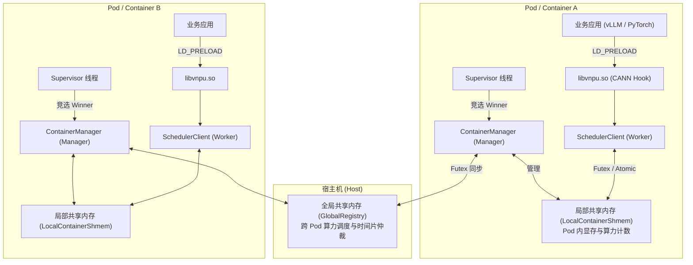

# HAMi-vnpu-core 缺陷核查与社区处理状态

核对日期：2026-10-03（Asia/Shanghai）。上游 `main` 经实时 `git ls-remote` 核实仍为 `962cb4867ee543ab0357ed90f4c27ae18d5d2198`。GitHub 状态通过 `gh` API 核实。

本文前半部分是逐项复核后的状态清单；后半部分保留原始审计报告。两者不一致时，以前半部分的核查结论为准。原始报告中的优先级和示例修复不等同于已验证的生产结论。

## 状态标记

- **我们已提交修复，待合并**：有 `xrwang8` 的独立修复 PR，但尚未进入上游 main。
- **社区已有修复 PR，待合并**：社区 PR 明确修改该问题的实现；不再重复提交。
- **仅有相关 PR／已评论**：PR 改了相关模块，但没有修复该问题；评论不代表修复完成。
- **Issue 已记录，无修复 PR**：已在跟踪 Issue 记录，尚未有对应实现。
- **待复现／待立项**：有源码线索或条件性风险，未具备完整复现和验收证据。
- **原描述不成立／需纠正**：不能以原报告的推理直接立项。

**当前没有任何一项能因 #19–#28 的提交而标为“上游已修复”。** 这些 PR 仍为 Open；#27、#14 已关闭且没有合并。

## 原报告逐项状态

| 编号 | 问题与复核结论 | 处理状态 | Issue／PR 与实际覆盖范围 |
|---|---|---|---|
| 3.1 | 全局共享内存初始化竞态成立。映射 0 字节文件通常在后续访问时触发 SIGBUS，而不是 mmap 调用本身。重复同尺寸 ftruncate 不会自动把整个文件清零，但重复写 lock_owner 会扰乱状态。 | **我们已提交修复，待合并** | [PR #26](https://github.com/Project-HAMi/hami-vnpu-core/pull/26)：同目录临时文件完成尺寸和 header 初始化后，以 link 原子发布；并发失败者丢弃临时映射并打开胜出者文件。另包含 fd 关闭、父目录创建。 |
| 3.2 | 单卡汇总被用于校准容器总 memory_used；死亡进程只清当前卡。两项成立。 | **我们已提交修复，待合并** | [PR #28](https://github.com/Project-HAMi/hami-vnpu-core/pull/28)：全设备汇总及死亡槽位全卡清理。此前 [PR #27](https://github.com/Project-HAMi/hami-vnpu-core/pull/27) 已关闭且未合并，以 #28 为当前提交。#22 不修复多卡统计。 |
| 3.3 | AtomicU64 fetch_sub 后补回存在瞬时下溢窗口。进程内 Mutex 不会同步不同进程。 | **社区已有修复 PR，待合并** | [PR #20](https://github.com/Project-HAMi/hami-vnpu-core/pull/20)：单票 CAS 扣减。#21 包含该依赖。修复不等于解决全部 state/batch 切换竞争。 |
| 3.4 | sigaction 篡改调用者 oldact 副本，可能破坏保存／恢复 handler 的链路；不直接修改内核当前 handler。 | **仅有相关 PR／已评论，未修复** | [PR #25](https://github.com/Project-HAMi/hami-vnpu-core/pull/25) 仅改 LazyLock 和依赖，保留原行为。[英文评论](https://github.com/Project-HAMi/hami-vnpu-core/pull/25#issuecomment-5965944937) 已指出问题；没有独立行为修复 PR。 |
| 4.1 | HBM 查询输出指针直接解引用，且忽略 memInfoType；分配 Hook 的输出指针直接解引用发生在底层返回成功后，不能把违反 RTS API 合约的调用自动认定为正常有效场景。 | **仅有相关 PR／已评论，未修复** | [PR #19](https://github.com/Project-HAMi/hami-vnpu-core/pull/19) 只复用 client；[英文评论](https://github.com/Project-HAMi/hami-vnpu-core/pull/19#issuecomment-5965964592) 已记录边界问题。#22 的算术保护不属于指针判空。具体错误码和 memInfoType 需依据目标 CANN 头文件验证。 |
| 4.2 | open_global_registry 没有关闭 fd，也未创建父目录；父目录原本由 README 要求部署预建。 | **我们已提交修复，待合并** | 与 3.1 合并在 [PR #26](https://github.com/Project-HAMi/hami-vnpu-core/pull/26)，不另开重复 PR。 |
| 4.3 | “只有一个 manager 时每轮扫描 64 次导致 head 膨胀”的描述不成立：pass_baton 先将自己重新入队，通常下一项就是自己。 | **原描述需纠正；另有历史问题** | 实际重复 manager 接管／队列覆盖已有 [Issue #13](https://github.com/Project-HAMi/hami-vnpu-core/issues/13) 和 [PR #14](https://github.com/Project-HAMi/hami-vnpu-core/pull/14)。二者已关闭，#14 未合并，不能当成 main 已修复。 |
| 4.4 | fork 时继承被其他线程持有的 LIMITER Mutex，子进程后续使用可能死锁。 | **社区已有修复 PR，待合并** | [PR #19](https://github.com/Project-HAMi/hami-vnpu-core/pull/19)：PID 标记的 ProcessLocal，子进程避开父进程对象／锁；有 fork 测试。它不修复初始化失败后永久 stub 的问题。 |
| 4.5 | Drop 不清 reports 确实留下陈旧数据，但死亡 PID 在下次注册时可被回收，不能笼统称为永久槽位泄漏。 | **部分成立，待细化复现** | #19 保留 client 生命周期会改变正常 Drop 触发方式，但不是 report 清理修复。需区分死亡回收、PID 复用和初始化失败残留。暂无专门修复 PR。 |
| 5.1 | proc_alive 的 stat[pos + 2..] 在异常截断数据下可能 panic。正常 procfs 内容一般不触发。 | **无专门修复 PR** | #23 是时间算术，#24 是日志初始化，#25 是依赖清理，均不修复此切片。建议低优先级独立边界测试。 |
| 5.2 | manager 设置 STATE_IDLE 后未 wake；下一轮 STATE_RUNNING 会 wake，通常是等待延迟，不是每轮必然死锁。 | **仅有相关 PR／已评论，未修复** | [PR #21](https://github.com/Project-HAMi/hami-vnpu-core/pull/21) 增加等待前复查，不补 manager 的 IDLE wake。[英文评论](https://github.com/Project-HAMi/hami-vnpu-core/pull/21#issuecomment-5965966533) 已请求明确协议。 |

## 补充发现与跟踪状态

以下是原报告之外的生命周期问题。严重性属于审计建议，应通过针对性回归与真实运行场景校准。

| 编号 | 建议优先级 | 问题、触发条件与源码 | 当前处理状态 |
|---|---|---|---|
| L1 | P2 | `SchedulerClient::new` 每 200ms 调用 `try_open_shmem`；文件尺寸合格但 initialized=0 时，已返回的静态 mmap 引用被丢弃，没有 munmap。一次 10s 等待就可能保留数十份映射；不是无限轮询，不能声称单次初始化无限泄漏。位置：worker.rs 的 new、shmem/setup.rs 的 try_open_shmem。 | **Issue 已记录，无修复 PR**。[Issue #18 补充评论](https://github.com/Project-HAMi/hami-vnpu-core/issues/18#issuecomment-5966387537)。#18 原正文也已有映射所有权修复设想，因此不是首次发现。#26 只改 global registry，不改 worker 的 local mmap 轮询。 |
| L2 | P1 | 初始化超时或 panic 被 npu_limiter 捕获并替换为 stub；stub 的显存配额为 0，计算入口直接返回，同 PID 后续缓存命中，不再重试真实 client。位置：hook/src/lib.rs 的 npu_limiter、worker.rs 的 stub。 | **Issue 已记录／相关 PR 已评论，未修复**。[PR #19 评论](https://github.com/Project-HAMi/hami-vnpu-core/pull/19#issuecomment-5966387348)。ProcessLocal 自身的 panic-retry 测试不能覆盖外层 catch_unwind 把失败转换成成功 stub 的路径。 |
| L3 | P2 | 先注册 reports，再注册 procs；若后一步注册失败，前一步没有回滚。当前上限 reports=32、procs=64，普通一进程一槽位场景不必然触发“procs 先满”；需构造陈旧／不一致槽位状态验证，不能称作必然容量故障。位置：worker.rs 的 new、register_worker_slot、register_proc_slot。 | **Issue 已记录，待复现，无修复 PR**。[Issue #18 补充评论](https://github.com/Project-HAMi/hami-vnpu-core/issues/18#issuecomment-5966387537)。与原 4.5 的 Drop 清理不是同一个缺陷。 |
| L4 | P1/P2 | 全 Pod 消失后，排队中非 owner 的 global slot 可能长期 active；注册只尝试 is_active CAS，不扫过期 heartbeat，公平份额计算也会读残留槽位。owner 死亡可由 watchdog 回收，但非 owner 不保证被检查。位置：manager.rs 的 register_global_slot、wait_for_global_turn、calculate_fair_share；supervisor.rs 的 reclaim_stale_global_slot。 | **Issue 已记录，无修复 PR**。[Issue #18 补充评论](https://github.com/Project-HAMi/hami-vnpu-core/issues/18#issuecomment-5966387537)。跨 Pod 的 PID 处于不同 namespace，不能直接用当前容器的 /proc 去判断全局 PID；应设计 heartbeat／owner generation 等回收规则。 |
| L5 | P2，条件性 | proc_alive 对所有 read_to_string 错误都返回 false；读取被权限／配置限制时可能把仍活着的其他进程误判死亡。ProcessSlot 只记录 PID，没有 start time，PID 复用也可能误认旧槽位。位置：worker.rs 的 proc_alive、shmem/mod.rs 的 ProcessSlot。 | **待复现／待立项**。#22 只对真实当前 PID 跳过查询，其他 PID 仍依赖该逻辑。未找到单独 Issue 或完整修复 PR；不可宣称已经向社区提交。 |
| L6 | P1/P2，条件性 | ensure_supervisor 在线程创建成功后保留 SUPERVISOR_PID；线程内部 catch_unwind 捕获 run 的 panic 后退出，没有清 PID 标记，后续 Hook 不再重启该进程的 supervisor。其他进程是否可接管决定最终影响。位置：hook/src/lib.rs 的 ensure_supervisor。 | **待复现／待立项**。没有专门修复 PR；#24 仅去重日志。还应区分配置缺失导致的有意 return 与运行故障导致的异常退出。 |

## 社区 PR 范围索引

| PR | 提交者／归属 | 实际范围 | 当前状态 |
|---|---|---|---|
| [#19](https://github.com/Project-HAMi/hami-vnpu-core/pull/19) | 社区 maverick-woo | fork-aware process client、Hook 内复用；不修 pointer guards、永久 stub 缓存 | Open，未合并 |
| [#20](https://github.com/Project-HAMi/hami-vnpu-core/pull/20) | 社区 maverick-woo | 单票 CAS、防瞬时下溢 | Open，未合并 |
| [#21](https://github.com/Project-HAMi/hami-vnpu-core/pull/21) | 社区 maverick-woo | 基于 #20 的同 stream 读锁快路径及 futex 等待前复查 | Open，未合并 |
| [#22](https://github.com/Project-HAMi/hami-vnpu-core/pull/22) | 社区 maverick-woo | 自身 procfs 查询跳过、配额／汇总算术保护；不修多卡总量和 pointer guards | Open，未合并 |
| [#23](https://github.com/Project-HAMi/hami-vnpu-core/pull/23) | 社区 maverick-woo | manager timeout、report end 的时间算术保护 | Open，未合并 |
| [#24](https://github.com/Project-HAMi/hami-vnpu-core/pull/24) | 社区 maverick-woo | supervisor 日志初始化去重 | Open，未合并 |
| [#25](https://github.com/Project-HAMi/hami-vnpu-core/pull/25) | 社区 maverick-woo | LazyLock、未使用依赖清理；保留 sigaction 改写行为 | Open，未合并 |
| [#26](https://github.com/Project-HAMi/hami-vnpu-core/pull/26) | 我们 xrwang8 | global registry 完整初始化后原子发布、fd 与目录处理 | Open，非 Draft，未合并 |
| [#27](https://github.com/Project-HAMi/hami-vnpu-core/pull/27) | 我们 xrwang8 | 首次多卡统计提交，已撤回 | Closed，未合并；由 #28 接续 |
| [#28](https://github.com/Project-HAMi/hami-vnpu-core/pull/28) | 我们 xrwang8 | 单卡显示／全卡总量分开、死亡槽位全卡清理 | Open，非 Draft，未合并 |
| [#14](https://github.com/Project-HAMi/hami-vnpu-core/pull/14) | 社区 maverick-woo | 等待 global turn 时保持心跳、防错误接管 | Closed，未合并；相关 Issue #13 已关闭 |
| [#12](https://github.com/Project-HAMi/hami-vnpu-core/pull/12) | 社区 ltaodream | 补 vLLM native kernel 的 Ascend RT launch hooks | Closed，未合并；属于历史覆盖缺口线索，未在本轮验证所有缺失入口 |

## 已完成的操作与验收边界

1. **代码提交**：我们提交了 #26、#28；#27 已关闭。没有在上游 main 直接修改代码。
2. **社区跟踪**：[Issue #18](https://github.com/Project-HAMi/hami-vnpu-core/issues/18) 已记录相关发现；Issue 仍 Open，assignee 为空。`xrwang8` assign 操作曾被 GitHub 权限拒绝，不能标为“已认领”。
3. **英文评论**：已在 #19、#21、#22、#25 评论未覆盖的问题；#26 有修复进展回复。当前 API 没有检索到我们在 #20 下的评论，之前聊天中“已评论 #20”的说法应纠正为“已有社区修复 PR，不重复实现”。
4. **本地验证**：#26、#28 的 ARM64 Linux `cargo check` 和 `git diff --check` 已通过。交叉编译检查不证明并发、异常退出或 NPU 运行正确。
5. **真实硬件验证**：我们的 #26、#28 尚无真实 Ascend/CANN 回归证据。社区 #18 正文记录过 #19–#22 的测试，但不能把其测试转用到我们的提交。
6. **剩余审查风险**：#28 只修复全卡汇总与清理，不解决“预约已写 memory_used、尚未写 hbm_used 时被重算扣掉”的并发计数竞态；不能宣称显存隔离整体完成。应补并发预约／重算回归。#26 不能修复已由旧版本遗留的损坏最终文件，也不等于完整的混合版本启动兼容性验证。

## 后续优先顺序

| 顺序 | 工作 | 处理方式 |
|---|---|---|
| 1 | #26、#28 的针对性回归，补多进程启动／创建者崩溃、全卡统计／并发预约验证 | 更新我们已有 PR，不另开重复提交；真实 CANN 行为须在 NPU 环境验证 |
| 2 | Token 与 fork-aware client | 跟进社区 #20、#19；评论只讨论具体仍有效缺口 |
| 3 | 永久 stub、supervisor 故障后不重启 | 根据 #19 的实现边界拆分；异常启动导致限制失效优先 |
| 4 | sigaction 行为与 FFI 输出／内存类型 | 分别立项；#25/#19 修改相同文件不代表已经覆盖这些行为修复 |
| 5 | 全局 manager 死亡回收、等待心跳／接管协议 | 对照 #13/#14 的历史方案，补跨 PID namespace 与 churn 场景 |
| 6 | local mmap 生命周期、注册回滚、procfs 判活和 PID 复用 | 补受控 CPU／多进程复现，确认 ABI 与设备插件兼容 |
| 7 | /proc 切片、IDLE wake、report 陈旧数据 | 独立小修复；避免把理论边界风险包装成已发生生产事故 |

---

# 原始审计报告（历史内容，未按本轮结论逐段重写）

以下为原文件保留内容。原始“P0/P1”评级、队列膨胀推理以及推荐代码均须结合上面的复核表阅读；不得直接用来证明已修复或已复现。

# HAMi-vnpu-core 代码审查与稳定性审计报告

> **项目名称**：Project-HAMi / hami-vnpu-core  
> **审计日期**：2026-10-03  
> **目标环境**：Linux (Ascend 910B / CANN Toolkit & Driver)  
> **报告类型**：架构与并发安全代码审查 (Code Review & Audit Report)

---

## 目录
1. [执行摘要 (Executive Summary)](#一执行摘要-executive-summary)
2. [项目架构与核心机制梳理](#二项目架构与核心机制梳理)
3. [严重与高危缺陷分析及修复方案 (P0 / P1)](#三严重与高危缺陷分析及修复方案-p0--p1)
   - [3.1 [P0 致命] 全局共享内存初始化竞态导致 SIGBUS 崩溃与重复覆盖](#31-p0-致命-全局共享内存初始化竞态导致-sigbus-崩溃与重复覆盖)
   - [3.2 [P0 致命] 多卡 (Multi-Device) 显存统计严重错误导致数据抹除与显存泄漏](#32-p0-致命-多卡-multi-device-显存统计严重错误导致数据抹除与显存泄漏)
   - [3.3 [P1 高危] `tokens_remaining` 无符号下溢回绕导致算力限制击穿](#33-p1-高危-tokens_remaining-无符号下溢回绕导致算力限制击穿)
   - [3.4 [P1 高危] 无差别全局劫持 `sigaction` 破坏应用程序信号链与崩溃捕获](#34-p1-高危-无差别全局劫持-sigaction-破坏应用程序信号链与崩溃捕获)
4. [中危缺陷与鲁棒性隐患 (P2)](#四中危缺陷与鲁棒性隐患-p2)
   - [4.1 Hook 函数缺乏指针判空与内存类型支持](#41-hook-函数缺乏指针判空与内存类型支持)
   - [4.2 全局共享内存文件描述符泄漏与父目录缺失](#42-全局共享内存文件描述符泄漏与父目录缺失)
   - [4.3 全局调度队列（`pass_baton`）无序膨胀与重复入队](#43-全局调度队列pass_baton无序膨胀与重复入队)
   - [4.4 `fork()` 多线程死锁风险（Mutex 未注册 `atfork`）](#44-fork-多线程死锁风险mutex-未注册-atfork)
   - [4.5 `register_worker_slot` 槽位泄漏与清理缺失](#45-register_worker_slot-槽位泄漏与清理缺失)
5. [低危隐患与性能建议 (P3)](#五低危隐患与性能建议-p3)
   - [5.1 `/proc/{pid}/stat` 字符串切片越界 Panic 隐患](#51-procpidstat-字符串切片越界-panic-隐患)
   - [5.2 `STATE_IDLE` 状态切换缺失 Futex Wake](#52-state_idle-状态切换缺失-futex-wake)
6. [修复优先级与落地路线图](#六修复优先级与落地路线图)

---

## 一、执行摘要 (Executive Summary)

`HAMi-vnpu-core` 采用 Rust 实现，设计理念先进（去中心化 Supervisor 进程竞选、基于 Futex 与共享内存的高性能 IPC、`LD_PRELOAD` 无侵入劫持）。

经过深度代码审计，**核心逻辑整体设计清晰，但在高并发、容器多实例启动、多卡（Multi-NPU）部署以及 POSIX 边缘场景下存在多处致命级（P0）与高危级（P1）隐患**。这些隐患可能导致：
1. 多个 Pod 并发启动时触发 `SIGBUS` 崩溃退出；
2. 在 2/4/8 卡训练或推理场景中，显存配额统计被单卡覆盖，引发显存泄漏或配额失效；
3. 高并发 Kernel 发射时 Token 下溢回绕成 `u64::MAX`，造成算力限制失效；
4. 破坏上层框架（如 PyTorch、vLLM）的信号处理机制。

建议在投入大规模生产前，按优先级完成修复。

---

## 二、项目架构与核心机制梳理



- **`crates/hook`**：动态劫持 `rtMalloc`、`rtKernelLaunch*`、`rtModelExecute` 等 Ascend RTS 核心符号。
- **`crates/limiter/src/supervisor.rs`**：各容器内随 Hook 初始化的常驻线程，通过 CAS `manager_pid` 竞选为本 Pod 唯一的 Manager。
- **`crates/limiter/src/manager.rs`**：持有全局锁的时间片轮转、批次 Token 下发、显存泄漏清理（Reaper 线程与 DCMI 硬件核对）。
- **`crates/limiter/src/worker.rs`**：业务线程发起显存申请前的 CAS 预扣减、Launch Kernel 前的 Token 获取与执行时间测量上报。

---

## 三、严重与高危缺陷分析及修复方案 (P0 / P1)

### 3.1 [P0 致命] 全局共享内存初始化竞态导致 SIGBUS 崩溃与重复覆盖

* **源码位置**：`crates/limiter/src/shmem/setup.rs` 中的 `open_global_registry` 函数 (第 67~107 行)
* **代码片段**：
  ```rust
  let mut fd = unsafe { open(c_path.as_ptr(), O_RDWR) };
  let mut needs_init = false;

  if fd < 0 {
      fd = unsafe { open(c_path.as_ptr(), O_RDWR | O_CREAT, 0o666 as c_uint) };
      needs_init = true;
  }
  let size = std::mem::size_of::<GlobalRegistry>();
  if needs_init {
      unsafe { ftruncate(fd, size as i64) };
  }
  let ptr = unsafe { mmap(..., size, PROT_READ | PROT_WRITE, MAP_SHARED, fd, 0) };
  ```
* **根本原因分析**：
  1. **TOCTOU 与 0 字节文件竞态**：当 Pod A 与 Pod B 并发启动时，Pod A 发现文件不存在并执行了 `open(O_CREAT)`。此时文件刚在文件系统中建立，**大小为 0**。
  2. 紧接着 Pod B 执行 `open(O_RDWR)`，此时由于文件已存在，Pod B 成功获取 `fd >= 0`，从而判定 `needs_init = false`。
  3. Pod B **直接跳过 `ftruncate`**，直接对 0 字节文件执行 `mmap(size)`。在 Linux 内核中，对超出物理文件大小的 mmap 地址进行读写操作，会直接触发内核产生 **`SIGBUS` (Bus Error)** 信号，导致 Pod B 异常死锁或直接 Crash。
  4. **重复初始化覆盖**：若 Pod A 和 Pod B 几乎同时进入 `fd < 0` 分支，两者都会执行 `O_CREAT` 和 `ftruncate`，导致正在运行的调度状态被意外清零。
* **推荐修复方案**：
  使用 Linux 独占创建标志 `O_CREAT | O_EXCL` 或使用内核文件锁 `flock` 进行原子性排他初始化；非创建者必须等待文件长度达到期望大小（`fstat` 校验）：

  ```rust
  pub fn open_global_registry(path: &str) -> &'static GlobalRegistry {
      if let Some(parent) = Path::new(path).parent() {
          let _ = std::fs::create_dir_all(parent);
      }
      let c_path = CString::new(path).unwrap();
      let size = std::mem::size_of::<GlobalRegistry>();

      // 1. 尝试原子创建（仅创建者负责扩容与初始状态设置）
      let mut fd = unsafe { open(c_path.as_ptr(), O_RDWR | O_CREAT | O_EXCL, 0o666 as c_uint) };
      let is_creator = fd >= 0;

      if !is_creator {
          // 2. 非创建者：等待创建者完成 ftruncate
          fd = unsafe { open(c_path.as_ptr(), O_RDWR) };
          if fd < 0 { panic!("Failed to open global registry: {}", path); }

          let deadline = std::time::Instant::now() + std::time::Duration::from_secs(10);
          loop {
              let mut st: libc::stat = unsafe { std::mem::zeroed() };
              if unsafe { libc::fstat(fd, &mut st) } == 0 && (st.st_size as usize) >= size {
                  break;
              }
              if std::time::Instant::now() >= deadline {
                  panic!("Timeout waiting for global registry initialization");
              }
              std::thread::sleep(std::time::Duration::from_millis(50));
          }
      } else {
          // 3. 创建者独占扩容并初始化
          if unsafe { ftruncate(fd, size as i64) } < 0 {
              panic!("Failed to ftruncate global registry: {}", path);
          }
      }

      let ptr = unsafe {
          mmap(std::ptr::null_mut(), size, PROT_READ | PROT_WRITE, MAP_SHARED, fd, 0)
      };
      unsafe { close(fd); } // 避免 fd 泄漏
      if ptr == MAP_FAILED { panic!("mmap failed for global registry"); }

      let reg = unsafe { &*(ptr as *const GlobalRegistry) };
      if is_creator {
          reg.lock_owner.store(MAX_MANAGERS as u32, Ordering::Release);
      }
      reg
  }
  ```

---

### 3.2 [P0 致命] 多卡 (Multi-Device) 显存统计严重错误导致数据抹除与显存泄漏

* **源码位置**：`crates/limiter/src/worker.rs` 中的 `recalculate_usage_for_device` (第 478~518 行)
* **代码片段**：
  ```rust
  pub fn recalculate_usage_for_device(&self, device: usize) -> u64 {
      let shmem = self.inner.shmem;
      let mut total = 0u64;
      let mut cleaned = 0u64;

      for slot in &shmem.procs {
          let pid = slot.pid.load(Ordering::Acquire);
          if pid == 0 { continue; }
          if !proc_alive(pid) {
              if slot.pid.compare_exchange(pid, 0, Ordering::AcqRel, Ordering::Relaxed).is_ok() {
                  let leaked = slot.hbm_used[device].swap(0, Ordering::Release); // ❌ 仅清理了当前 device 单卡
                  slot.is_active.store(0, Ordering::Release);
                  cleaned += leaked;
              }
              continue;
          }
          total += slot.hbm_used[device].load(Ordering::Acquire); // ❌ 仅累加了当前 device 单卡
      }
      ...
      // ❌ 用当前单卡的 total 强制覆写整个 Pod 的 memory_used！
      let current = shmem.memory_used.load(Ordering::Acquire);
      if total > current {
          let add = total - current;
          shmem.memory_used.fetch_add(add, Ordering::Release);
      } else if total < current {
          let sub = current - total;
          atomic_saturating_sub(&shmem.memory_used, sub);
      }
      total
  }
  ```
* **根本原因分析**：
  1. **多卡显存被强制截断**：`shmem.memory_used` 是整个容器（Pod）维度的总显存计数。如果容器挂载了多张 NPU 卡（如 8 卡），在卡 0 上分配显存后，卡 1 分配时触发 `check_memory_quota`，会调用 `recalculate_usage_for_device(1)`。此时 `total` 仅计算了卡 1 的显存，然后执行 `total < current`，**直接把卡 0 已经使用的数十 GB 显存从 `memory_used` 中强行扣除**！配额限制形同虚设。
  2. **死亡进程多卡显存泄漏**：当检测到死亡进程时，CAS 将 `slot.pid` 成功设为 0，但**只将 `slot.hbm_used[device]` 单张卡的值置 0**。由于 `slot.pid` 已经为 0，后续其他卡上的显存统计永远跳过该 slot，导致该死亡进程在其余卡上占用的显存永远泄漏在共享内存中。
* **推荐修复方案**：
  区分 **“Pod 维度全卡总使用量计算”** 与 **“单卡设备用量展示”**。在重新校准容器内存时，必须累加所有设备；清理死亡进程时，必须循环清理 `0..NPU_DEVICE_MAX` 所有设备：

  ```rust
  pub fn recalculate_usage_for_device(&self, device: usize) -> u64 {
      let shmem = self.inner.shmem;
      let mut dev_total = 0u64;
      let mut all_dev_total = 0u64;
      let mut total_cleaned = 0u64;

      for slot in &shmem.procs {
          let pid = slot.pid.load(Ordering::Acquire);
          if pid == 0 { continue; }
          if !proc_alive(pid) {
              if slot.pid.compare_exchange(pid, 0, Ordering::AcqRel, Ordering::Relaxed).is_ok() {
                  // 1. 原子清理该死亡进程在所有 NPU 卡上的显存
                  for d in 0..shmem::NPU_DEVICE_MAX {
                      let leaked = slot.hbm_used[d].swap(0, Ordering::Release);
                      total_cleaned += leaked;
                  }
                  slot.is_active.store(0, Ordering::Release);
              }
              continue;
          }
          dev_total += slot.hbm_used[device].load(Ordering::Acquire);
          for d in 0..shmem::NPU_DEVICE_MAX {
              all_dev_total += slot.hbm_used[d].load(Ordering::Acquire);
          }
      }

      // 2. 用所有卡的总和校准容器全局 memory_used
      if total_cleaned > 0 {
          atomic_saturating_sub(&shmem.memory_used, total_cleaned);
      }
      let current = shmem.memory_used.load(Ordering::Acquire);
      if all_dev_total > current {
          shmem.memory_used.fetch_add(all_dev_total - current, Ordering::Release);
      } else if all_dev_total < current {
          atomic_saturating_sub(&shmem.memory_used, current - all_dev_total);
      }

      dev_total
  }
  ```

---

### 3.3 [P1 高危] `tokens_remaining` 无符号下溢回绕导致算力限制击穿

* **源码位置**：`crates/limiter/src/worker.rs` 中的 `wait_for_token` (第 259~287 行)
* **代码片段**：
  ```rust
  // tokens_remaining 类型为 AtomicU64
  let prev = self.inner.shmem.tokens_remaining.fetch_sub(1, Ordering::Acquire);
  if prev > 0 {
      ...
      return; // 成功获取 Token
  } else {
      // Race failed，尝试复原
      self.inner.shmem.tokens_remaining.fetch_add(1, Ordering::Relaxed);
  }
  ```
* **根本原因分析**：
  - `tokens_remaining` 为 `AtomicU64`。当剩余 Token 恰好为 0 时，线程 A 执行 `fetch_sub(1)`，返回 `prev = 0`。
  - 在底层无符号整数计算中，`0u64.wrapping_sub(1)` 变为 **`18446744073709551615` (`u64::MAX`)**。
  - 在线程 A 执行下一行 `fetch_add(1)` 恢复之前的并发瞬间，若线程 B 进入判断：
    ```rust
    let tokens = self.inner.shmem.tokens_remaining.load(Ordering::Relaxed);
    ```
    线程 B 读取到的值是 `u64::MAX`，随即通过校验并执行 `fetch_sub`，误认为获取到了合法 Token 而直接发射 Kernel！这会导致瞬时并发极高时算力限制被直接击穿。
* **推荐修复方案**：
  改用原子 CAS 循环或 `fetch_update` 进行非负扣减，保证绝对不下溢：

  ```rust
  let acquired = self.inner.shmem.tokens_remaining.fetch_update(
      Ordering::AcqRel,
      Ordering::Acquire,
      |current| {
          if current > 0 {
              Some(current - 1)
          } else {
              None // 不扣减，直接返回失败
          }
      },
  ).is_ok();

  if acquired {
      // 成功获取 Token
      ...
      return;
  }
  ```

---

### 3.4 [P1 高危] 无差别全局劫持 `sigaction` 破坏应用程序信号链与崩溃捕获

* **源码位置**：`crates/hook/src/signal_compat.rs` 中的 `sigaction` 函数 (第 12~30 行)
* **代码片段**：
  ```rust
  #[unsafe(no_mangle)]
  pub extern "C" fn sigaction(
      signum: libc::c_int,
      act: *const libc::sigaction,
      oldact: *mut libc::sigaction,
  ) -> libc::c_int {
      let ret = REAL_SIGACTION(signum, act, oldact);
      if ret == 0 && !oldact.is_null() {
          unsafe {
              let handler = (*oldact).sa_sigaction;
              if handler != libc::SIG_DFL && handler != libc::SIG_IGN {
                  (*oldact).sa_sigaction = libc::SIG_DFL; // ❌ 暴力篡改所有旧信号处理器为默认
              }
          }
      }
      ret
  }
  ```
* **根本原因分析**：
  1. 通过 `LD_PRELOAD` 加载后，此函数无差别拦截了该容器内所有进程对 `sigaction` 的调用。
  2. 只要调用者传入了 `oldact` 指针（例如 Python、PyTorch、GDB 调试器、faulthandler 等常见的“读取并保存旧 Handler，之后恢复”的信号链保护模式），**原有注册的处理函数被强制修改为 `SIG_DFL`**。
  3. 当业务框架后续尝试调用 `sigaction(sig, &oldact, NULL)` 恢复原有处理器时，原有的自定义信号处理逻辑（优雅停机、堆栈打印、清理显存等）被彻底破坏。
* **推荐修复方案**：
  若此 workaround 仅为了规避特定 Python 版本的某个已知 bug，**切勿全局覆盖**。应严格限定针对特定信号（例如仅针对 `SIGINT`），或者通过环境变量开关控制；更推荐的做法是定位 Python 报出的根本原因，移除对此危险系统调用的无差别劫持。

---

## 四、中危缺陷与鲁棒性隐患 (P2)

### 4.1 Hook 函数缺乏指针判空与内存类型支持
* **源码位置**：
  - `crates/hook/src/hook.rs#L41`：
    ```rust
    let actual_ptr = unsafe { *(devPtr as *const u64) };
    ```
    未校验 `devPtr` 是否为 0（空指针）。在 C/C++ API 中，若外部传入非法指针，解引用将直接导致应用进程段错误崩溃。
  - `crates/hook/src/hook.rs#L98-L104` 及 `crates/limiter/src/worker.rs#L540`：
    ```rust
    pub extern "C" fn rtMemGetInfoEx(memInfoType: u64, free: *mut usize, total: *mut usize) -> u64 {
        if npu_limiter().is_hbm_limited() {
            npu_limiter().get_hbm_info(free, total);
            return 0;
        }
        ...
    }
    // worker.rs 内部：
    unsafe {
        *total = quota;
        *free = reported_free; // 若上层仅查询 total 而将 free 传为 NULL，直接 SIGSEGV
    }
    ```
* **修复建议**：
  在解引用 `free` 和 `total` 前必须进行空指针检查（`if !free.is_null()`），并检查 `memInfoType`（区分 HBM 与 Host 内存类型）。

---

### 4.2 全局共享内存文件描述符泄漏与父目录缺失
* **源码位置**：`crates/limiter/src/shmem/setup.rs#L70-L98`
* **问题详情**：
  `open_global_registry` 中通过 `open` 打开了文件，在 `mmap` 完成后**未调用 `close(fd)`**，导致文件描述符泄漏；且未像 `create_shmem` 一样创建父目录，若主机挂载路径不存在将直接 panic。
* **修复建议**：
  加入父目录预创建 `std::fs::create_dir_all`，并在 `mmap` 成功后立即调用 `close(fd)`。

---

### 4.3 全局调度队列（`pass_baton`）无序膨胀与重复入队
* **源码位置**：`crates/limiter/src/manager.rs#L241, L304`
* **问题详情**：
  在 `manager.run()` 启动前调用了一次 `self.join_global_queue()`，进入主循环后每次交接批次 `pass_baton()` 又调用了一次 `self.join_global_queue()`。当只有一个 Manager 运行时，循环内部扫描 `MAX_MANAGERS` 次找不到新候选者，`next_head` 累加了 64，导致队头 `queue_head` 跃迁膨胀，长期运行可能引起队列索引混乱。
* **修复建议**：
  重新梳理队列入队与出队契约，保证同一 Manager 在队列中只占有一个有效等待项。

---

### 4.4 `fork()` 多线程死锁风险（Mutex 未注册 `atfork`）
* **源码位置**：`crates/hook/src/lib.rs#L42-L52`
* **问题详情**：
  ```rust
  static LIMITER: Mutex<Option<(i32, SchedulerClient)>> = Mutex::new(None);
  ```
  AI 训练与数据加载（如 PyTorch `DataLoader(num_workers > 0)` 或 Python `multiprocessing`）重度依赖 `fork()`。根据 POSIX 标准，在多线程程序中调用 `fork()` 时只有调用线程被复制，但 Mutex 的锁状态会被完全复制。如果在 `fork()` 的瞬间父进程另一个线程恰好持有 `LIMITER` 锁，子进程中的该锁将永久处于锁定状态，导致子进程后续第一次调用 NPU 接口时**永久死锁**。
* **修复建议**：
  建议使用 `pthread_atfork` 在 fork 前后重置 Mutex，或者使用 Lock-free 结构（如 `AtomicPtr`）替代标准库 `Mutex`。

---

### 4.5 `register_worker_slot` 槽位泄漏与清理缺失
* **源码位置**：`crates/limiter/src/worker.rs#L120-L150` 与 `L608-L615`
* **问题详情**：
  在 `SchedulerClientInner::drop` 中清理了进程槽位（`self.shmem.procs[self.my_proc_idx]`），但**遗漏了对上报槽位 `self.shmem.reports[self.my_slot_idx]` 的清理**。`reports` 数组中该槽位会一直残留旧 PID，只能依赖 `proc_alive` 慢速扫描清理。
* **修复建议**：
  在 `SchedulerClientInner::drop` 中同步将 `reports[self.my_slot_idx].pid` 与 `occupied` 重置为 0。

---

## 五、低危隐患与性能建议 (P3)

### 5.1 `/proc/{pid}/stat` 字符串切片越界 Panic 隐患
* **源码位置**：`crates/limiter/src/worker.rs#L591-L596`
* **问题详情**：
  ```rust
  if let Some(pos) = stat.rfind(')') {
      let rest = &stat[pos + 2..]; // ❌ 若 stat 异常截断或结尾字符不足，直接 panic
      if let Some(ch) = rest.chars().next() {
          return ch != 'Z' && ch != 'X' && ch != 'x';
      }
  }
  ```
* **修复建议**：改用安全的切片索引 `stat.get(pos + 2..)`，避免因文件末尾偶发读截断导致 panic。

---

### 5.2 `STATE_IDLE` 状态切换缺失 Futex Wake
* **源码位置**：`crates/limiter/src/manager.rs#L502`
* **问题详情**：
  Manager 进入 `STATE_RUNNING` 与 `STATE_MEASURING` 时均调用了 `futex::wake_all(&self.local.state)`，但在完成批次统计进入 `STATE_IDLE` 时仅执行了 `self.local.state.store(STATE_IDLE, Ordering::Release)`，缺失了 `wake_all`。部分仍在等待状态的 Worker 线程只能等到下一轮启动或超时才能被唤醒。
* **修复建议**：在置位 `STATE_IDLE` 后补充 `futex::wake_all(&self.local.state)`。

---

## 六、修复优先级与落地路线图

| 优先级 | 缺陷项 | 影响范围 | 预计工作量 | 状态建议 |
| :---: | :--- | :--- | :---: | :---: |
| **P0** | **3.1 全局共享内存初始化竞态 (SIGBUS)** | 跨 Pod 多实例启动崩溃 | 0.5 天 | 立即修复 |
| **P0** | **3.2 多卡显存统计被单卡覆盖 (显存失准)** | 多卡训练/推理显存统计 | 0.5 天 | 立即修复 |
| **P1** | **3.3 `tokens_remaining` 无符号下溢击穿** | 高并发算力控制失效 | 0.2 天 | 立即修复 |
| **P1** | **3.4 全局劫持 `sigaction` 破坏信号链** | 影响 Python/PyTorch 稳定性 | 0.5 天 | 评审并下线或收窄范围 |
| **P2** | **4.1 Hook 指针判空与类型校验** | 异常调用下 SIGSEGV | 0.2 天 | 近期修复 |
| **P2** | **4.2 全局共享内存 fd 泄漏与父目录检查** | 系统资源稳定性 | 0.1 天 | 近期修复 |
| **P2** | **4.4 `fork()` 多线程安全与 Mutex 死锁** | 子进程 DataLoader 死锁 | 0.5 天 | 近期修复 |
| **P3** | **5.1 字符串切片边界防护 & 5.2 Futex Wake** | 边缘防御与唤醒延迟 | 0.2 天 | 随版本迭代优化 |
